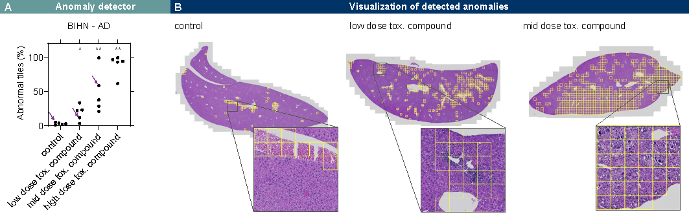
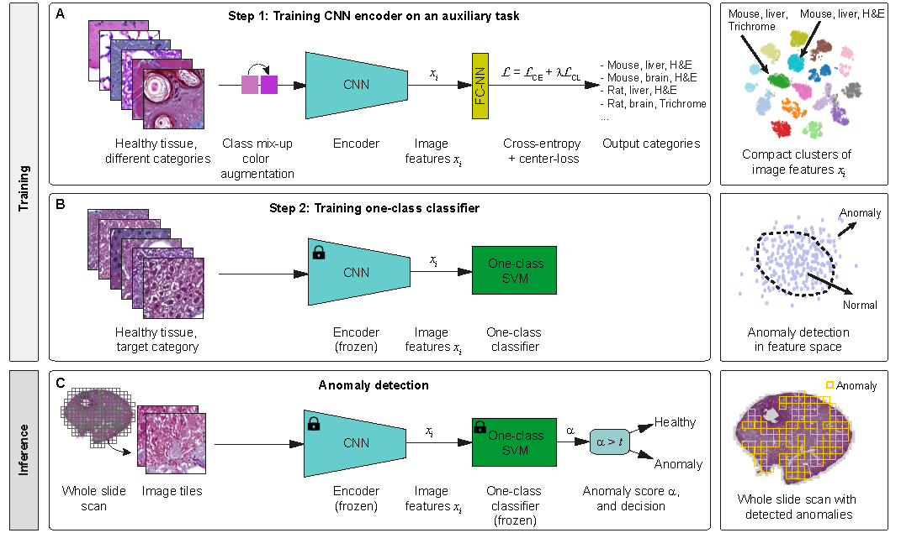

# Learning Image Representations for Anomaly Detection

-------

This repository contains Pytorch implementation of **training image representations** and **performance evaluation** of the approach introduced in
*Zingman et al. ["Learning image representations for anomaly detection: application to discovery of
histological alterations in drug development", CoRR, 2022.](https://arxiv.org/abs/2210.07675)*

The paper develops a method for anomaly detection in whole slide images of stained tissue samples in order to routinely screen histopathological data for abnormal alterations in tissue. 



**Figure** above shows detection of adverse drug reactions by the Boehinger Ingelheim Histological Network (BIHN) based anomaly detection. **A:** The developed Anomaly Detection (AD) method detects induced tissue alterations in
the liver of mouse after administration an experimental compound. The fraction of abnormal tiles increases with the the dosage of the compound. The
compound was previously found to have toxic side effects in toxicological screening by pathologists. Each dot corresponds to a single Whole Slide Image (WSI). Three arrows
correspond to three WSI examples given in **B**. Stars on the top of the graph show statistical significance of the change compared to the mean of control
group. **B:** Examples of detected anomalies. In the control group (left image) blood and a few other not pathological structures result in a low level of false
positives. Detections in compound treated groups (two right images) correspond to pathological alterations and were confirmed by a pathologist.

------
**Requirements**

```PyTorch```, ```NumPy```, ```Pillow```, ```scikit-learn```

The code in the repository was tested under ```Python 3.9``` with GPU 11GB and packages' listed in the ```requirements.txt```.
It, however, should also run with earlier Python versions and smaller GPU memory.

**Experiments** (training image representations and performance evaluation)



**Setting up dataset**

* The training dataset with normal tissue of different species, organs, and staining can be downloaded from ```data/train/``` folder from https://osf.io/gqutd/.
This dataset was used for training image representations.

* The evaluation dataset with normal mouse liver tissue and mouse tissue with Non-Alcoholic Fatty Liver Disease (NAFLD) can
be downloaded from ```data/test/``` folder from https://osf.io/gqutd/

* Due to large sizes of zip files it is recommended to download each zip file separately.

* Create the folder structure shown below under the root folder of your repository with the cloned code or in any other location. 
In the last case set ```_prj_root``` variable to the chosen location in ```configs/cfg_training_cnn.py``` and ```configs/cfg_anomaly_detector.py``` configuration files.
We use .py configuration, not e.g. yaml. This allows more flexibility, is still simple enough, and helpful for prototyping.

* Unzip downloaded data files to the corresponding folders within the created folders structure

* If you want to use pre-trained models (instead of training yourself)
  * download them from ```trained models/``` folder from https://osf.io/gqutd/.
  * unzip and save ```EfficientNet_B0_320_HE_Liver_Mouse_acc0.9762.pt``` model and ```EfficientNet_B0_320_HE_Liver_Mouse_acc0.9762_training_configuration.pkl``` configuration file into ```BIHN_models_HE``` folder, 
  ```EfficientNet_B0_320_Masson_Liver_Mouse_acc0.9755.pt``` model and ```EfficientNet_B0_320_Masson_Liver_Mouse_acc0.9755_training_configuration.pkl``` configuration file into ```BIHN_models_MT``` folder,
  and the corresponding ```EfficientNet_B0_320_Masson_Liver_Mouse_acc0.9755.pkl``` and ```EfficientNet_B0_320_HE_Liver_Mouse_acc0.9762.pkl``` models (SVM classifiers) into the corresponding ```anomaly_detection_*``` subfolders.
    (see below folders structure)

**Folders structure for project's input and output**  
```
 .
 ├── data
 │   ├── test
 │   │   ├── NAFLD_anomaly_he_mouse_liver
 │   │   ├── NAFLD_anomaly_mt_mouse_liver
 │   │   ├── normal_he_mouse_liver
 │   │   └── normal_mt_mouse_liver
 │   └── train
 │       ├── he_mouse_brain
 │       ├── he_mouse_heart
 │       ├── he_mouse_kidney
 │       ├── he_mouse_liver
 │       ├── he_mouse_lung
 │       ├── he_mouse_pancreas
 │       ├── he_mouse_spleen
 │       ├── he_rat_liver
 │       ├── mt_mouse_brain 
 │       ├── mt_mouse_heart
 │       ├── mt_mouse_kidney
 │       ├── mt_mouse_liver
 │       ├── mt_mouse_lung
 │       ├── mt_mouse_pancreas
 │       ├── mt_mouse_spleen
 │       └── mt_rat_liver
 └── results
     ├── BIHN_models_HE
     │   └── anomaly_detection_EfficientNet_B0_320_HE_Liver_Mouse_acc0.9762
     └── BIHN_models_MT
         └── anomaly_detection_EfficientNet_B0_320_Masson_Liver_Mouse_acc0.9755

```

**Training**

* Set variable ```data_staining``` in ```configs/cfg_training_cnn.py``` to either ```Masson``` (Massosn's Trichrome staining) or ```HE```(H&E staining) values, which will
adjust training image representations for anomaly detection in images of tissue stained correspondingly. 
* Run ```python train_cnn.py --config configs/cfg_training_cnn.py```
 
**Evaluation**

* Set ```cnn_model``` variable in ```configs/cfg_anomaly_detector.py``` to the path to trained PyTorch model, which was 
either automatically generated in folder ```results/stamp/model_name.pt``` during the training step above, or to the path to downloaded pre-trained model in 
folder ```results/BIHN_models_staining/model_name.pt```  (see **setting up dataset** section above). 
* Run ```python anomaly_detector.py --config configs/cfg_anomaly_detector.py```. 

*Expected performance of anomaly detection with BIHN models*

| Staining         |  Balanced accuracy  |  AU-ROC  |  F<sub>1</sub> score  |
|------------------|:-------------------:|:--------:|:---------------------:|
| H&E              |       94.20%        |  97.33%  |        94.09%         |
| Masson Trichrome |       97.51%        |  99.03%  |        97.51%         |

* To evaluate other algorithms from [Anomalib library](https://github.com/openvinotoolkit/anomalib) on our dataset with NAFLD pathology,
please consult Anomalib section *Custom Dataset*. Particularly, one needs to set appropriate paths in yaml configuration files of the chosen method located at ```anomalib_root/anomalib/models/method/config_file.yaml```.
The paths fields to be set in yaml are ```normal_dir```, ```abnormal_dir```, ```normal_test_dir```, which should point to ```./data/train/*mouse_liver/```, ```./data/test/NAFLD_anomaly_*_mouse_liver```,  ```./data/test/normal_*_mouse_liver``` data paths correspondingly.
The star in paths refers to a particular staining type, ```mt``` or ```he``` you want to experiment with. The ```task``` field should be set to "classification".
* To evaluate [DPA](https://github.com/ninatu/anomaly_detection) appraoch we adapted ```Camalyon16Dataset``` class, reading images from NAFLD dataset.
We obtained our best results for DPA using ```camelyon16``` ```wo_pg_unsupervsed``` default configuration with the following parameters tuned ```inner_dims: 16, latent_dim:16``` (for both decoder and encoder, same values for all layers as in the default configuration), ```initial_image_res:256, max_image_res:256, crop_size: 256```.
Batch size was reduced to 64 to be able to run on 256x256 size images.

**Citing**
```markdown
@article{zingman2022anomaly,
      title={Learning image representations for anomaly detection: application to discovery of histological alterations in drug development},
      author={Igor Zingman and Birgit Stierstorfer and Charlotte Lempp and Fabian Heinemann},
      year={2022},
      journal={CoRR},
      volume={abs/2210.07675},    
      eprinttype = {arXiv},
      url = {https://arxiv.org/abs/2210.07675}
}
```
```markdown
@online{NAFLD_dataset,
  author    = {Igor Zingman and Birgit Stierstofer and Fabian Heinemann},
  title     = {{NAFLD} pathology and healthy tissue samples},  
  year      = {2022},
  url       = {https://osf.io/gqutd/},   
}
```


